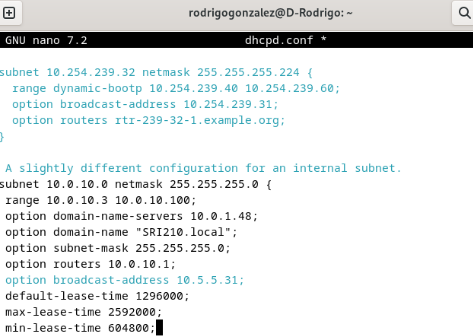
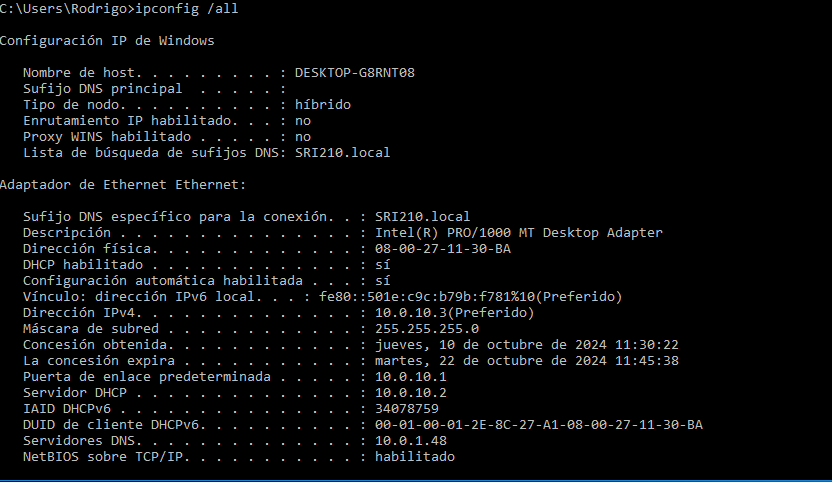
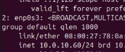

# **Practica 2: Instalación y configuración de DHCP en Debian**
Rodrigo González Collantes
 
 # Índice

- **Práctica 2: Instalación y configuración de DHCP en Debian**
  - Preparación de las máquinas
    - Instalación del servidor DHCP
    - Configuraciones adicionales del servidor DHCP
    - Requisitos de configuración
    - Reiniciar el servicio y verificación
  - Ejercicio 2. Configuración de los clientes DHCP
    - Configurar equipos Windows y Linux como clientes DHCP
    - Verificación de asignación de IPs
    - Verificación de parámetros enviados por el servidor
    - Conectividad y conexión a Internet
  - Ejercicio 3. Funcionamiento del servicio
    - Actividad registrada en los logs del sistema
    - Explicación de los mensajes DHCP

## Preparación de las máquinas
Antes de comenzar me aseguro de que tengo las máquinas de debian, ubuntu, windows y el router de pfsense en la red interna correspondiente(SRI210)

 

 a) Instala el servidor DHCP en la máquina correspondiente.
 
 

b) Realiza las configuraciones adicionales necesarias para que funcione el servidor DHCP.

 
>c) Realiza las configuraciones necesarias para cumplir los siguientes requisitos:

    a. El servidor repartirá direcciones IP en el rango 10.0.XX.1 - 10.0.ΧΧ. 100.
    b. Utilizará la máscara por defecto correspondiente a esa subred.
    c. Deberá utilizar como puerta de enlace la que corresponda según el diagrama de red.
    d. Como servidor DNS preferido se utilizará el del instituto (deberás averiguarlo) y como alternativo el de google.
    e. Además, se enviará a los clientes el sufijo DNS sriXX.local
    f. Para el cliente Ubuntu se le reservará la dirección 10.0.XX.60.
    g. Respecto a los tiempos de alquiler:
    i. El tiempo de alquiler por defecto será de 15 días para todos los equipos.
    ii. Nunca será superior a 30 días.
    iii. Nunca será inferior a 1 semana.

 

d) Reinicia el servicio y verifica que tras el reinicio está activo y en ejecución.

Al volver a entrar vemos que dhcpd.conf sigue como lo hemos editado

## Ejercicio 2. Configuración de los clientes DHCP.
>a) Configura los equipos Windows y Linux como clientes DHCP.
 b) Observa dentro del archivo adecuado del servidor si las IPs han sido asignadas.

 

 

 

c) Observa dentro de ambos clientes que son correctos todos los parámetros enviados por el servidor, es decir:
 
    i. IP
 
    ii. Máscara
 
    iii. Puerta de enlace
 
    iv. DNS primario
 
    v. DNS alternativo
 
    i. Nombre de dominio
 
    vii. La MAC del equipo que tiene la reserva.

 
d) Verifica que existe conectividad entre los equipos y que además ambos equipos se conectan a Internet.

 

 

## Ejercicio 3. Funcionamiento del servicio.
 
Para terminar, deberás explicar la actividad generada por el servidor isc-dhcp-server que has instalado y configurado y que se ha registrado en los logs del sistema por la herramienta Journalctl.

**DHCPDISCOVER:**
Es el mensaje que envía un dispositivo cliente cuando intenta localizar un servidor DHCP en la red para obtener una dirección IP.

**DHCPOFFER:**
Se ofrece una dirección IP al cliente a través de este mensaje.

**DHCPREQUEST:**
Una vez que el cliente recibe la oferta de IP, envía este mensaje para confirmar su interés en esa dirección IP.

**DHCPACK:**
El servidor DHCP responde con este mensaje para confirmar que la dirección IP ha sido asignada al cliente y que está lista para ser utilizada.

 

 

 
 

 

 

 
